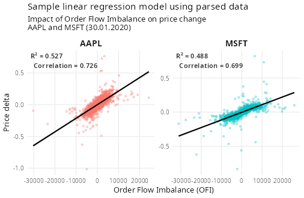

# 📈 Microstructure Research Pipeline Based on Ultra-Low Latency HFT Engine

Quantitative research framework and high-performance execution engine written in Modern C++20 and R, designed around the [NASDAQ ITCH 5.0 standard](https://www.nasdaqtrader.com/content/technicalsupport/specifications/dataproducts/NQTVITCHSpecification.pdf).


## 📊 Quantitative Analysis: Order Flow Imbalance (OFI)

To prove the engine's capability of extracting actionable signals from raw market noise, an econometrical evaluation was conducted on historical, publicly available ITCH data from Jan 30, 2020 for major tech symbols (AAPL, MSFT).

The C++ engine integrates a continuous event-driven accumulator calculating the **Order Flow Imbalance (OFI)**—measuring the net discrete pressure of additions, executions, and cancellations at the Best Bid and Offer (BBO). Following the theoretical framework of *Cont, R., Kukanov, A., & Stoikov, S. (2014) "The price impact of order book events" (Journal of Financial Econometrics)*, the model evaluates short-term price discovery.
It is known, that in the tick-short time the price is to some degree deterministic.



### Results (OLS Regression Output)
* **Statistical Significance:** The t-statistic for the OFI variable yielded $t = 41.2$ for MSFT ($p\text{-value} = 1.17 \times 10^{-260}$) and $t = 46.6$ for AAPL ($p\text{-value} = 3.41 \times 10^{-319}$), unequivocally rejecting the random-walk null hypothesis at microstructure horizons
* **Predictive Power ($R^2$):** The linear model achieves an $R^2$ of **48.8%** for MSFT and **52.7%** for AAPL at the event-group level ($n = 1779$ and $n = 1949$ observations respectively). This demonstrates that net limit order flow shifts dominate short-term price formation, providing a highly reliable alpha signal
* **Price Impact Coefficient ($\beta$):** The estimated sensitivity coefficient for AAPL ($\beta = 2.14 \times 10^{-5}$) is nearly twice as high as MSFT ($\beta = 1.12 \times 10^{-5}$), revealing that Apple's mid-price was significantly more sensitive to order flow imbalances, indicative of different underlying market depth properties
## 🚀 Engine Architecture & Latency Benchmarks
*Testing platform: Ryzen 7 9700X (3.8GHz), 32GB RAM (6000MT/s), GCC -O3 -march=native*

While the research layer analyzes data statstically, the underlying execution infrastructure mimics production HFT constraints: **strict cache locality** and **zero heap allocations on the hot path**.

The following micro-benchmarks (powered by Google Benchmark) execute a continuous matching loop with randomised, shuffled inputs to bypass the CPU prefetcher and simulate realistic L1/L2 cache pressure:

| Operation (Randomized Input) | Latency (ns) | CPU Cycles (approx.) | Throughput (Single-Thread) |
|------------------------------|--------------|----------------------|----------------------------|
| `AddOrder`                   | ~9.95 ns     | ~38 - 54 cycles      | ~100.5 Million op/s        |
| `ReduceOrderVolume`          | ~11.93 ns    | ~45 - 65 cycles      | ~83.8 Million op/s         |
| `RemoveOrder`                | ~16.77 ns    | ~64 - 92 cycles      | ~59.6 Million op/s         |
| `ReplaceOrder` (ITCH 'U')    | ~30.20 ns    | ~115 - 166 cycles    | ~33.1 Million op/s         |

## 🗂️ Hardware-Optimized Data Structures

Unlike some popular designs, my engine aims to **reduce cache misses and pointer chasing** on the critical path, so
I avoided the dynamically allocated standard C++ containers for the sake of tailor-cut structures

1. **Custom allocator `MemoryPool`**
    - Zero heap allocation during runtime: no `new`/`delete`
    - One array for both the data and pointers - thanks to the intrusive list design in `order_pool`
    - Pointers to the allocated orders are stored in a flat array `order_map` for a fast O(1) access

2. **O(1) access to `PriceLevelBucket`**
    - No hashing (`std::unordered_map` or custom hash table) nor binary trees `std::map`
    - Price levels pointers stored in a flat array (`PriceLevelBucket*`).
    - Eliminating cache misses and pointer chasing

3. **Bitboard Price Discovery**
    - Chess engines inspired design for ultra-fast discovery of a new `best_bid` and `best_ask`
    - Bitboard array of uin64_t mapping to active `PriceLevelBucket` (1 = active, 0 = inactive)
    - Single-cycle CPU instructions from C++20 `<bit>` (`std::countl_zero` / `std::countr_zero`) instead of iterating through pointers

### Memory Layout Diagram

```text
=============================================================================
                     LIMIT ORDER BOOK: MEMORY LAYOUT
=============================================================================

 1. BITBOARD (active_price_levels) price -> active_price_levels[block_index][bit_index] (accessed via C++20 <bit> operations)
 ----------------------------------------------
 uint64_t block [781]: [ 00000000...00110000...00000000 ]
                                      ||
                                      |+-- Bit 16 (Mapped to index 50000)
                                      +--- Bit 17 (Mapped to index 50001)
                                      |
                     +----------------+
                     v
 2. FLAT BUCKET ARRAY (price_level_bucket_pool)
  [!] Of course in the real code the variables are arranged in the manner that avoids unnecessary padding [!]
 ----------------------------------------------
 Index:     [  ...  ] [     50000     ] [     50001     ] [     50002     ]
 Price:     [  ...  ] [    $500.00    ] [    $500.01    ] [    $500.02    ]
 Volume:    [  ...  ] [      150      ] [      200      ] [       0       ]
 first_ptr: [  nil  ] [  0x7f..1a40   ] [  0x7f..1a90   ] [      nil      ]
 last_ptr:  [  nil  ] [  0x7f..1b80   ] [  0x7f..1a90   ] [      nil      ]
                               |                 |
                     +---------+                 +---+
                     |                               |
                     v                               v
 3. MEMORY POOL & INTRUSIVE LIST (order_pool)
 ----------------------------------------------
              +-------------------+     +-------------------+
0x7f..1a40 -> | Order ID: 1       |     | Order ID: 4       | <- 0x7f..1b80
              | Volume:   100     |     | Volume:   50      |
              | prev:     nil     |<----| prev: 0x7f..1a40  |
              | next:  0x7f..1b80 |---->| next:     nil     |
              +-------------------+     +-------------------+
```

## ⚙️ Building & Testing

The project requires a C++20 compliant compiler and CMake version $\ge$ 3.20.

```bash
# Clone the repository
git clone [https://github.com/m-koska/hft-orderbook.git](https://github.com/m-koska/hft-orderbook.git)
cd hft-orderbook

# Configure and compile using Release profile (-O3 -march=native)
cmake -B build-release -DCMAKE_BUILD_TYPE=Release 
cmake --build build-release -j 14

# Run structural Google Benchmark micro-tests
./build-release/engine_benchmark
```