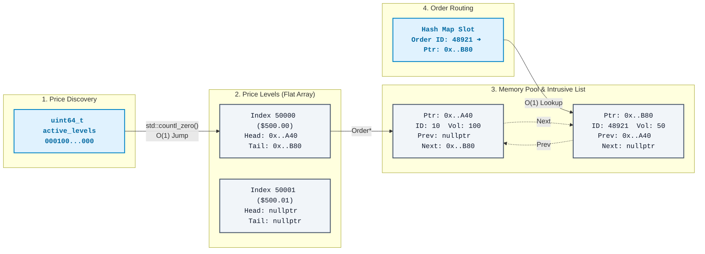

# 📈 Ultra-Low Latency HFT Engine & Microstructure Research Pipeline

High-performance limit order book execution engine written in Modern C++23, designed around the [NASDAQ ITCH 5.0 standard](https://www.nasdaqtrader.com/content/technicalsupport/specifications/dataproducts/NQTVITCHSpecification.pdf), bundled with historical data replayer and an R-based quantitative research framework.

**Take a look:**
* 📄 **[Quantitative Research Report](research/README.md)**
* 🔄 **[Changelog & Architecture Updates](CHANGELOG.md)**

## 🚀 Engine Architecture & Latency Benchmarks
*Testing platform: Ryzen 7 9700X (3.8GHz), 32GB RAM (6000MT/s), GCC -O3 -march=native*

The execution infrastructure mimics production High-Frequency Trading constraints: **strict cache locality** and **zero heap allocations on the hot path**. Micro-benchmarks (Google Benchmark) executing a continuous matching loop with randomized inputs demonstrate the following latency profile:

| Operation (Randomized Input) | Latency (ns) | CPU Cycles (approx.) | Throughput (Single-Thread) |
|------------------------------|--------------|----------------------|----------------------------|
| `ReduceOrderVolume`          | ~13.98 ns    | ~53 cycles           | ~71.5 Million op/s         |
| `AddOrder`                   | ~14.70 ns    | ~56 cycles           | ~68.0 Million op/s         |
| `RemoveOrder`                | ~19.26 ns    | ~73 cycles           | ~51.9 Million op/s         |
| `ReplaceOrder` (ITCH 'U')    | ~36.48 ns    | ~139 cycles          | ~27.4 Million op/s         |

## 🧠 Hardware-Optimized Data Structures

To minimize cache misses and pointer chasing, the engine entirely avoids standard dynamically allocated containers (`std::map`, `std::unordered_map`) on the critical path.

1. **Custom `MemoryPool` & Intrusive Lists**
   - Zero heap allocation during runtime. Data and pointers to the next free elements share the same pre-allocated contiguous array thanks to C++ `union`.
   - Sparse 64-bit Order IDs are resolved via a custom, open-addressing, pre-allocated `HashMap` for constant time lookups without allocating memory on insertions.
   - Hash conflicts are resolved via  linear probing, achieving high cache locality and minimising pointer chasing overhead.
2. **Constant Time Price Level Access**
   - Naturally bounded price ticks are mapped directly to a flat array (`PriceLevelBucket*`), eliminating hash collisions and tree traversals.
3. **Bitboard Price Discovery**
   - A `uint64_t` bitboard maps to active price buckets. Uses C++20 `<bit>` instructions (`std::countl_zero` / `std::countr_zero`) to jump directly to the new `best_bid` / `best_ask` in a single CPU cycle. Protocol parsing utilizes C++23 `std::byteswap` for zero-cost endianness conversions.

### 🗂️ Memory Layout & Execution Flow

To maximise cache locality, the engine minimises heap fragmentation by utilising a custom Memory Pool. While intrusive doubly-linked lists inherently involve pointer chasing, pre-allocating `Order` structures in contiguous memory blocks ensures that these dereferences remain highly cache-friendly. This architecture completely eliminates the `new`/`delete` OS overhead on the hot path.


**Constant-Time Order Lookup (Custom Hash Map)**
When a cancellation or modification arrives we resolve to a dedicated flat `HashMap`. It translates the sparse 64-bit `Order ID` keys directly into a memory pointer in $O(1)$ time using a lightweight Fibonacci Hashing on powers of 2 and linear probing conflict resolving for cache locality.
> `[ Order ID: 48921 ] ━━(hash)━━▶ [ Ptr: 0x..B80 ]`

**The Memory Pool (Contiguous Array)**
All orders live in a pre-allocated flat array (`Order[]`). Intrusive doubly-linked lists connect orders at the same price level using direct memory pointers. Because the nodes are contiguous, this necessary pointer chasing remains highly cache-friendly.
> `Node at 0x..A40: { ID: 10, Vol: 100, prev: nullptr, next: 0x..B80 }`
> 
> `Node at 0x..B80: { ID: 48921, Vol: 50, prev: 0x..A40, next: nullptr }`

**Price Level Buckets (Flat Array)**
Since stock prices move in fixed ticks, price levels are mapped directly to a flat array. Each bucket simply holds the `head` and `tail` pointers to the orders waiting in the Memory Pool.
> `PriceLevel[50000] ($500.00) ━━▶ points to 0x..A40 as head`

**Bitboard Price Discovery**
To find the new Best Bid or Best Ask after all orders from a certain level are removed, the engine doesn't loop through empty price buckets. It uses an array of 64-bit integers where each bit represents a price level (1 = active, 0 = empty).
> `00001000...0000 ━━▶ std::countl_zero() ━━▶` instantly returns the exact index of the next active price level in a single CPU cycle.

## 📊 Quantitative Validation: Order Flow Imbalance (OFI)

To validate the engine's parsing accuracy and data pipeline, the output was subjected to econometric evaluation using historical ITCH data for chosen high volume stocks (AAPL, MSFT).

The C++ engine tracks a continuous **Order Flow Imbalance (OFI)** accumulator. Following the theoretical frameworks of *Cont et al. (2014)* regarding Order Flow Imbalance (OFI) impact on the price, the pipeline tests the short-term determinism of price discovery at the microsecond scale.
It has been proven, that in the microscale OFI has a linear relation with the mid-price delta.

* The multivariate linear regression model achieves an R-squared of **30.2%** for MSFT and **37.5%** for AAPL.
* These results are aligned with what is expected based on the literature.
For the full statistical output, methodology, and empirical price impact curves, see the **[Quantitative Research Report](research/README.md)**.

## ⚙️ Building & Testing

Requires a C++23 compliant compiler and CMake version 3.20 or higher.

```bash
git clone https://github.com/m-koska/hft-orderbook.git
cd hft-orderbook

cmake -B build-release -DCMAKE_BUILD_TYPE=Release 
cmake --build build-release -j 14

./build-release/engine_benchmark
```